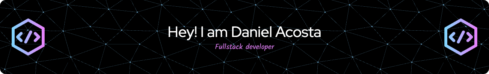

<h1 align="center">Hi 👋, I'm Daniel Acosta</h1>
<h3 align="center">A passionate full stack developer from Perú</h3>

  

- 🌱 I’m currently learning **NestJs and Astro**

- 💬 Ask me about **Flutter, Vue, Laravel**

- 📫 How to reach me **dacostap1.upao@gmail.com**

- ⚡ Fun fact **I like videogames and play piano**

<h3 align="left">Connect with me:</h3>

<h3 align="left">Languages and Tools:</h3>

                      

